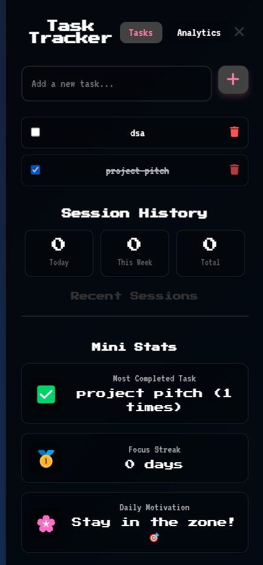
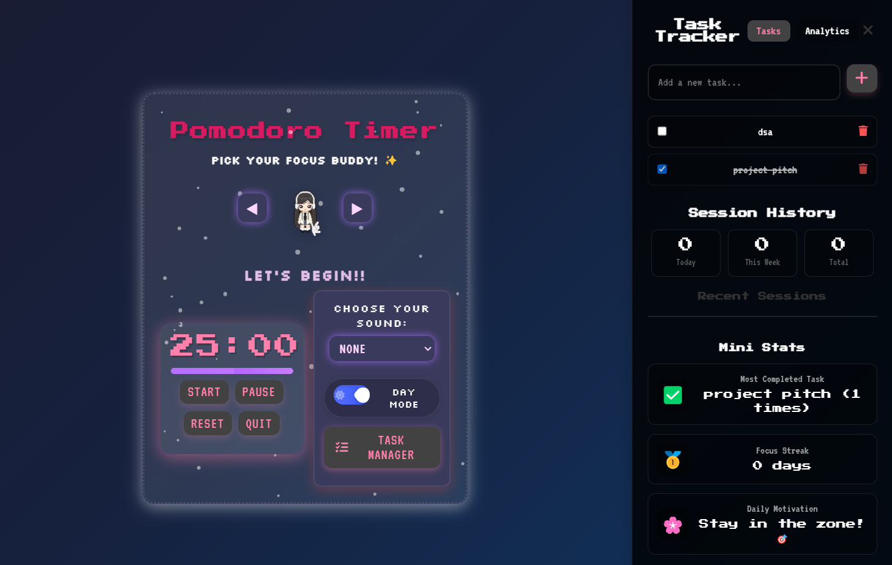

# Pomodoro Focus Companion

A pixel-perfect Pomodoro desktop app built with **Electron.js**, designed to help users stay focused and organized — with a sprinkle of cuteness ✨

Whether you're working, studying, or just trying to vibe without distractions, this app turns productivity into a cozy ritual.

---

## 🌟 Why I Built This

As a designer-developer passionate about productivity and delightful interfaces, I wanted to craft a Pomodoro app that felt less clinical and more *comforting*. Something with:

- Personality (hello, little focus buddy!)
- Functional beauty (bento layout, task tracking, analytics)
- Aesthetic charm (pixel fonts, pastel modes, animated touches)

This is my take on **"cozy tech meets clever tools."**

---

## ✨ Features

- ⏱ **Pomodoro Timer** with Start / Pause / Reset controls
- 🧍‍♂️ **Focus Buddy** – pick your character companion
- 🎵 **Ambient Sound Picker** – rain, café, or focus music
- 🌗 **Day/Night Mode Toggle** – dynamic theming
- ✅ **Task Tracker** – add, complete, and delete tasks
- 📊 **Analytics Dashboard** – charts, streaks, completion rate
- 🔁 **Session History + Mini Stats** – track your daily focus
- 🗂 **Offline-First** – no login, no cloud, just pure local goodness
- 💅 Pixel fonts, soft glows, animated details – for that *extra charm*

---

## 📸 Gallery

### ☀️ Light Mode   
  
  
### 🌙 Dark Mode


### ✅ Task Tracker + Stats


### 📊 Weekly Analytics


### Layout
 

### Sounds
 
---

## 🧠 Built With

- [Electron.js](https://www.electronjs.org/)
- HTML5 + CSS3 (with love)
- Vanilla JavaScript
- Chart.js for data visualizations
- FontAwesome + Google Fonts for icons & style

### 🔧 Prerequisites

- [Node.js](https://nodejs.org/) installed

### ▶️ Run Locally

```bash
git clone https://github.com/your-username/pomodoro-desktop-app.git
cd pomodoro-desktop-app
npm install
npm start
```

### 📦 Package the App
To generate an executable version (Windows/macOS/Linux):

```bash
Copy
Edit
npm run build
