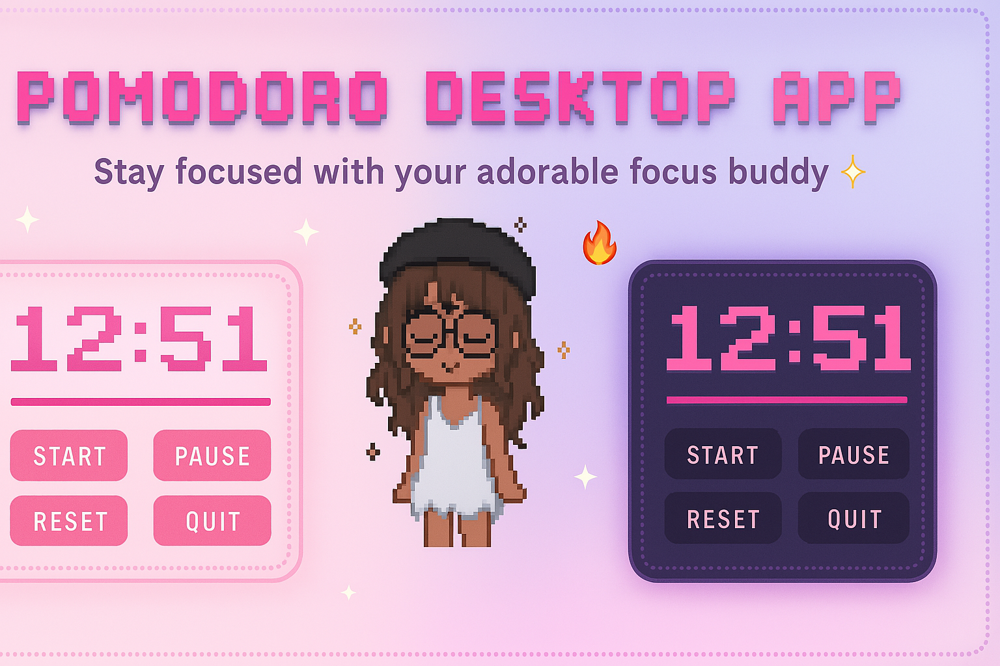
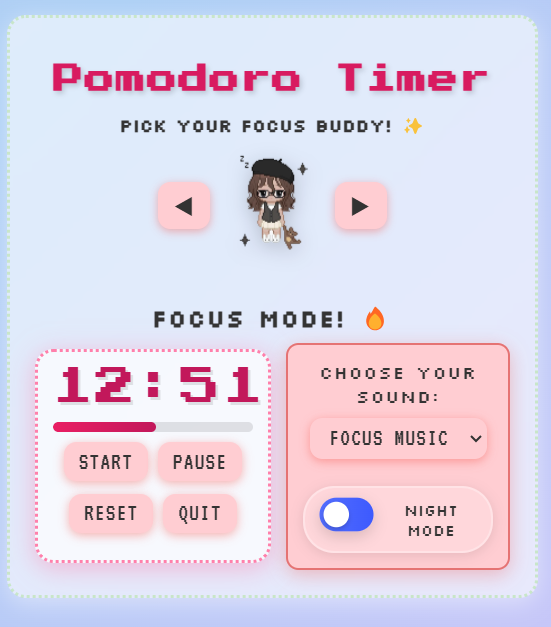
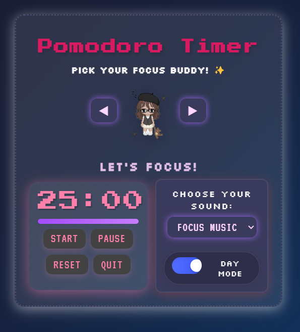
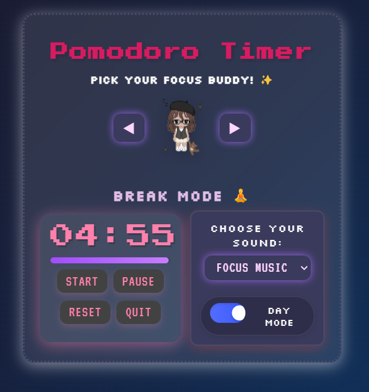
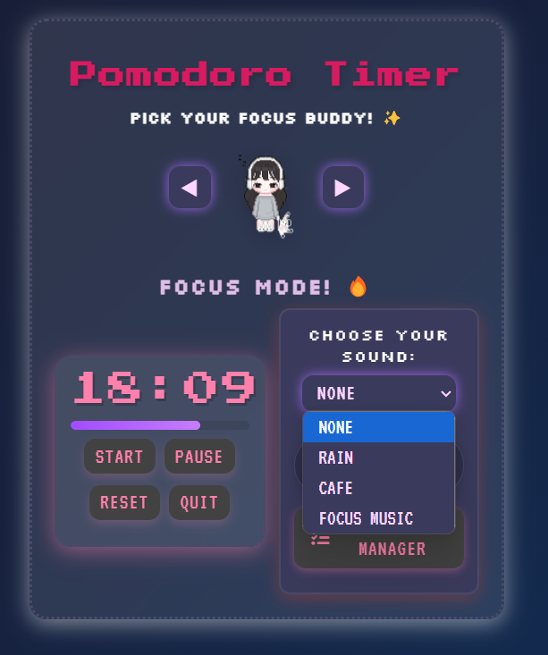

<p align="center">
  
</p>

# Pomodoro Desktop App

A minimalist and aesthetic Pomodoro timer built with Electron.js.  
Stay focused with your adorable little buddy 🧍💤 — whether you're studying, working, or just vibing.

---

## ✨ Features

- ⏱ **Bento-style Pomodoro layout** — no distractions, just vibes  
- 🧍‍♂️ **Focus Buddy** — a cute little friend to keep you company  
- 🌗 **Day & Night Modes** — switch themes based on your mood  
- 🔊 **Optional background music** — lo-fi focus feels  
- 💻 **Cross-platform** and runs offline  
- 🛠 Built using **Electron + JavaScript**

---

## 📸 Screenshots

### ☀️ Light Mode   >>>>>>>>>>>>>>>🌙 Dark Mode  
            
                                                      


### Sounds>>>>>>>>>>>>>>>>>>>>>>Break Timer              
                                


---

## 🚀 Getting Started

### 🔧 Prerequisites

- [Node.js](https://nodejs.org/) installed

### ▶️ Run Locally

```bash
git clone https://github.com/your-username/pomodoro-desktop-app.git
cd pomodoro-desktop-app
npm install
npm start
```

### 📦 Package the App
To generate an executable version (Windows/macOS/Linux):

```bash
Copy
Edit
npm run build
